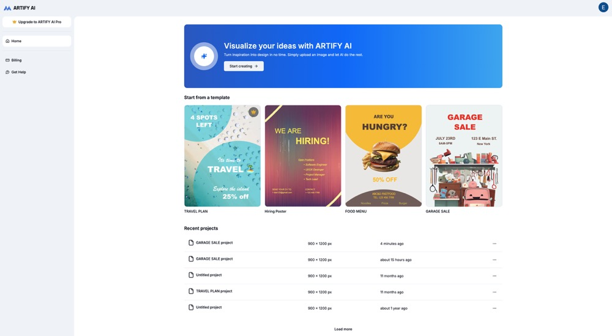

# Artify AI

Artify AI is a modern web application for AI-powered image creation and editing. It leverages advanced models for generating images from text prompts and removing image backgrounds, making creative projects easier and faster.



## Features

- **Text-to-Image Generation:** Generate images from prompts using external AI models (e.g., Stable Diffusion).
- **Background Removal:** Remove backgrounds from images using Hugging Face-hosted AI models.
- **Image Templates & Galleries:** Browse customizable templates and curated images from sources like Unsplash.
- **Modern Frontend:** Built with React, TanStack Query, Radix UI, and Tailwind CSS for a smooth, interactive experience.
- **Authentication & Uploads:** Supports OAuth-based login and secure image uploads.
- **Extensible API:** Backend powered by Hono for scalable and modular API development.

## Tech Stack

- **Frontend:** Next.js, TypeScript, React, Tailwind CSS, Radix UI
- **State Management:** TanStack Query
- **Backend/API:** Hono
- **AI Models:** Replicate, Hugging Face Transformers (RMBG for background removal)
- **Image Hosting:** UploadThing, Unsplash
- **Authentication:** Auth.js

## Getting Started

1. **Clone the Repository**
   ```bash
   git clone https://github.com/eizyc/artify-ai.git
   cd artify-ai

2.Install Dependencies
npm install
# or
yarn install

3.Set Environment Variables
Add your API keys for Replicate, Hugging Face, Unsplash, and other services to a .env.local file.

4.Run the Development Server
npm run dev
# or
yarn dev

5.Open in Browser
Visit http://localhost:3000 to use the app.

